footer: **CoVis CoWorking** - *covisco.com* - @covisco

# [fit] Git Basics :tada:
###maybe more, maybe less.

---


# [fit] Skid Vis
## @skidvis :wink:

---

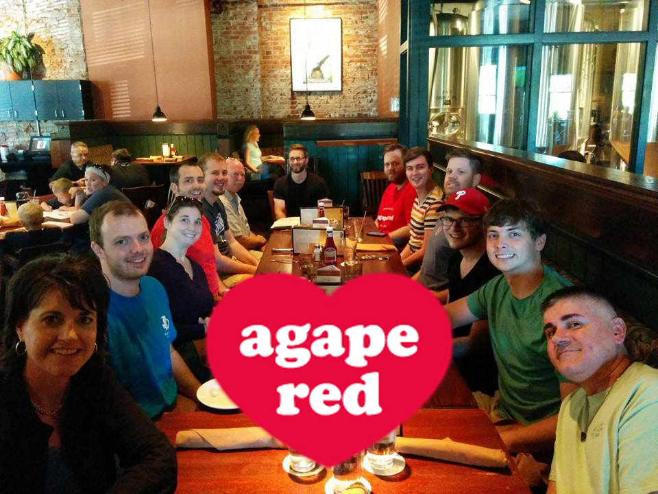
## Consultant at 
#Agape :heart: Red
###Feb 2014

---


#**CoVis CoWorking**
###April 2012
### covisco.com

---


# [fit] Warning:
# [fit] I like gifs.

---

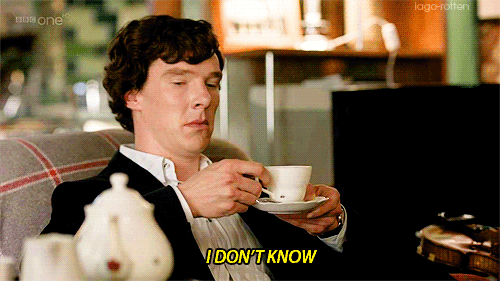
# [fit]What is git?
# [fit]
# :question:
---


# [fit]A Way To Repel
# [fit]Stray Dogs?
#no. :dog:
---

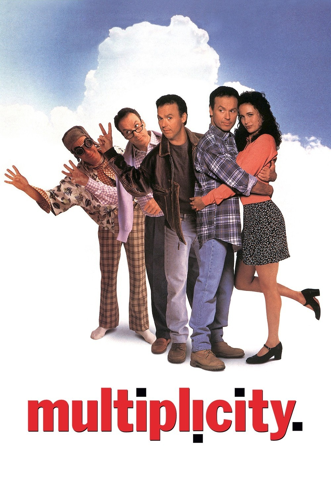
# [fit]Version
# [fit]Control
---


# [fit]Time
# [fit]Machine
# :hourglass:
---


##another
# [fit]Time
# [fit]Machine
## just in case
---

##The website says:
##Git is a distributed revision control system with an emphasis on speed, data integrity, and support for distributed, non-linear workflows.
---

#[fit]Make Sense?

---

#[fit]It will. :mortar_board:
###but maybe it won't.
---
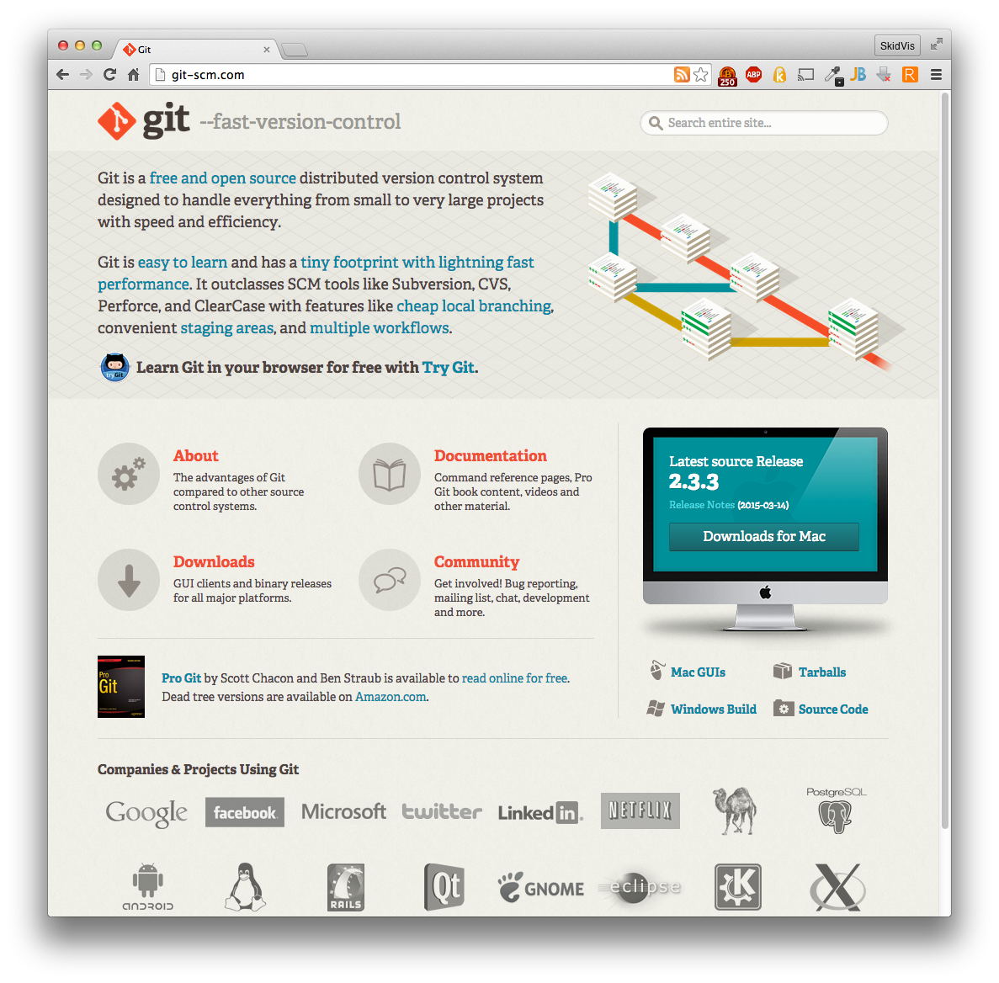
#[fit]Where do I get it?
#[fit]
#[fit]git-scm.com
#[fit]
# :computer:
---
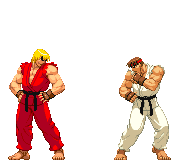
#[fit]How is it 
#[fit]better than..
---

#[fit]Sorry, No.
#[fit]Not this time.
#[fit]
# :no_entry_sign:
---

#[fit]Why should I use it?
- It's awesome.
- Everyone else is.
- Created by the linux guy.
- Résumé on github.


---
#[fit] Git != Github
# or
# Github < > Git
##whatevs, gosh

---

#[fit]Soapbox time.
#[fit]
#[fit]
#Use the command line tools.
#[fit]
# :rocket:

---

#[fit]Save your 
#[fit]questions.
#[fit]
##..until after my escape.
#[fit]
# :runner:
---

#[fit]Let's Git 
#[fit]Started
#[fit]


---
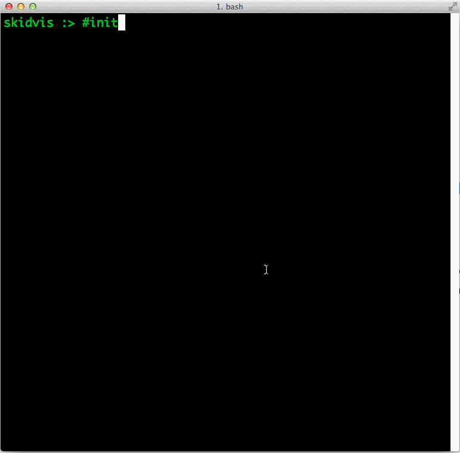
#[fit] ```git init```
#[fit]
#[fit]
#[fit]
#[fit]
#[fit]
##Creates an empty Git repository or reinitializes an existing one.
# [fit]
# :star2:
---

#[fit]The Magical
#[fit].git
#[fit]directory
---

#[fit] ```git status```
#[fit]
#[fit]
#[fit]
#[fit]
#[fit]
##Show the working tree status
# [fit] 
# [fit] 
# :mag:
---
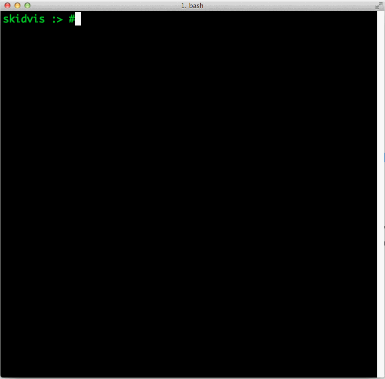
#[fit] ```git add <filename>```
#[fit]
#[fit]
#[fit]
#[fit]
#[fit]
##Add file contents to the index
---
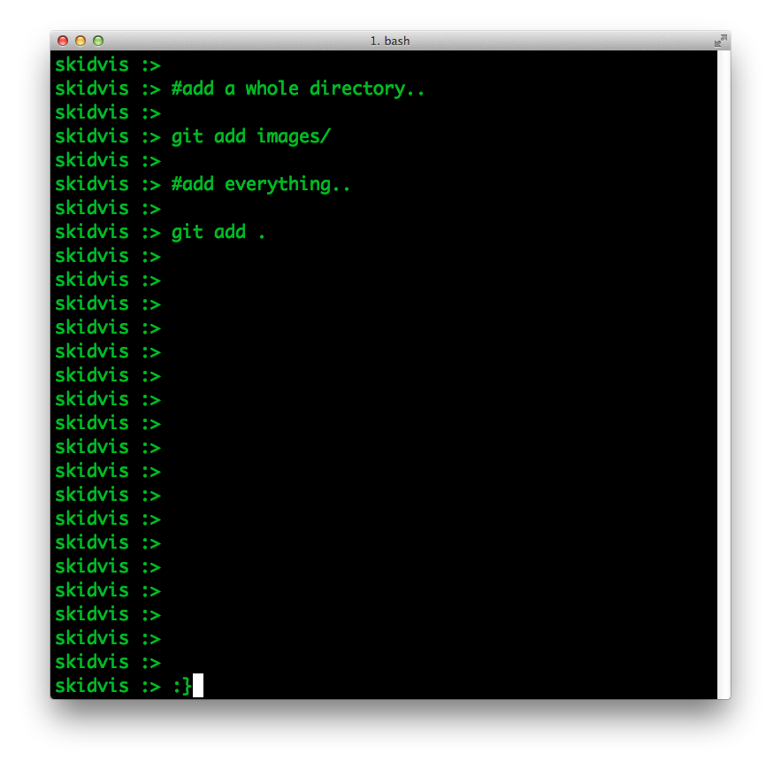
#[fit] ```git add <filename>```
#[fit]     
#[fit]     
#[fit]     
#[fit]     
#[fit]     
#[fit]     
#[fit]     
#[fit]     
#[fit]     
#[fit]     
#[fit]     
#[fit]     
#[fit]     
#[fit]     
#[fit]     
#[fit]     
#[fit] ```git add <directory>```
#[fit]     
#[fit]     
#[fit]     
#[fit]     
#[fit]     
#[fit]     
#[fit]     
#[fit]     
#[fit]     
#[fit]     
#[fit]     
#[fit]     
#[fit]     
#[fit]     
#[fit]     
#[fit]     
#[fit] ```git add .         ```
#[fit]     
#[fit]     
#[fit]     
#[fit]     
#[fit]     
#[fit]     
#[fit]     
#[fit]     
#[fit]     
---

#[fit]What does
#[fit]add
#[fit]actually do?
---
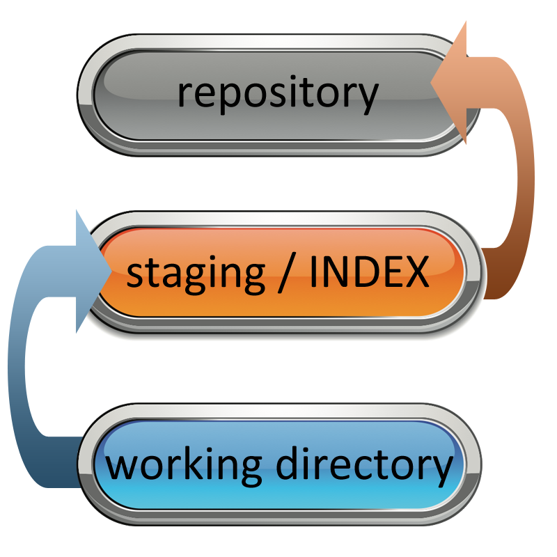
#[fit]3 Stages
#[fit]of brain-tingling fun!
---

#[fit]Working Directory
#[fit]The directory where you work.
---
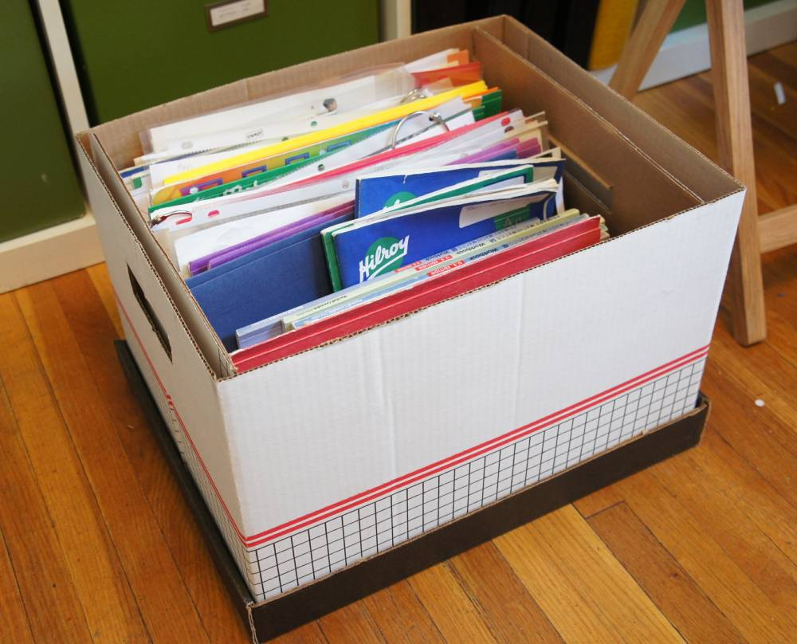
#[fit]Staging
###also called the INDEX
#[fit]What you want to keep.
---

#[fit]Repository
#### 
#[fit]I know what I'm doing, 
#[fit]commit my actions 
#[fit]to the annals of
#[fit]awesomeness!
---
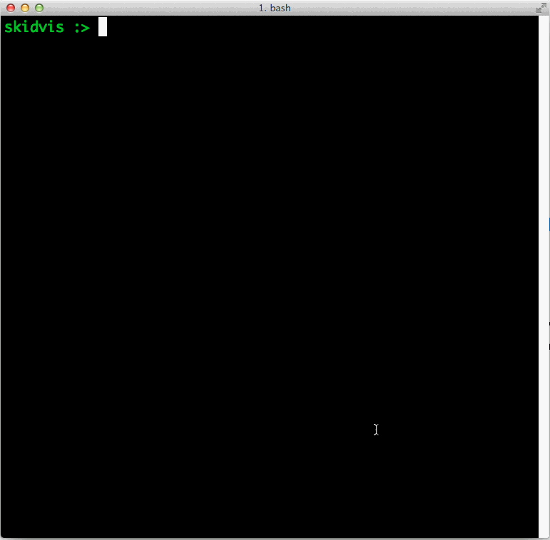
#[fit] ```git commit```
#[fit]
#[fit]
#[fit]
#[fit]
#[fit]
##Record changes to the repository
#[fit]
#[fit]
#[fit]
# :ring:
---
#[fit]commit message "rules":
#### 
##Be as verbose as you want. want a lot.
####[fit]
##Be descriptive. What changed?
####[fit]
##Speak in the present tense.
---
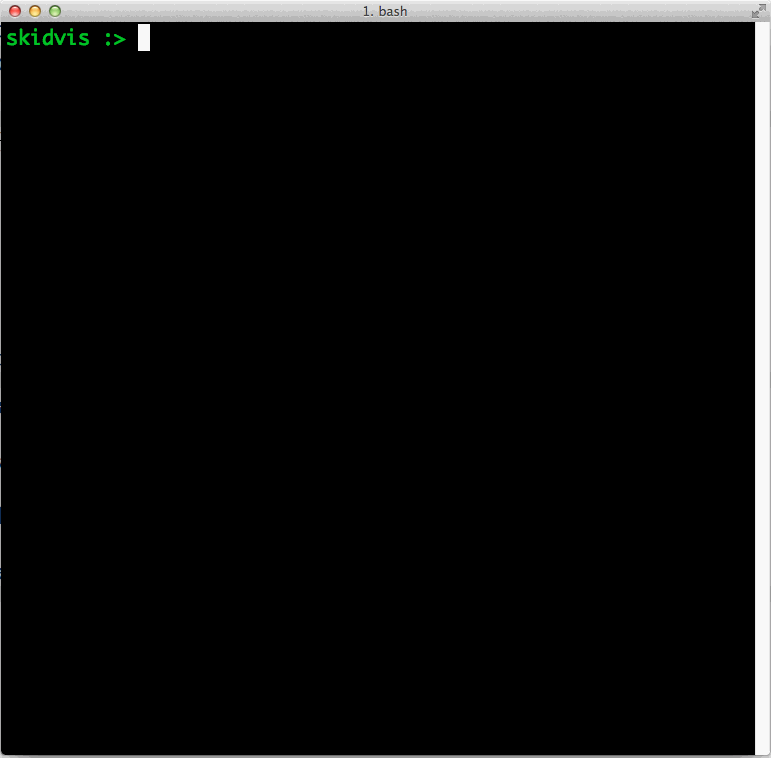
#[fit] ```git log```
#[fit]
#[fit]
#[fit]
#[fit]
#[fit]
##Show commit logs
#[fit]
#[fit]
#[fit]
# :scroll:
---

#[fit] ```git log --oneline```
#[fit] 
#[fit]  
#[fit]Make it easier to read.
#[fit]
#[fit]
#[fit]
# :eyes:
---
#[fit]Hashes
#[fit] What's with the weird numbers and stuff?
#[fit] 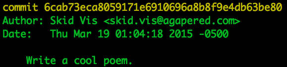
---
#[fit]Use the hash
### It's useful!
#[fit] 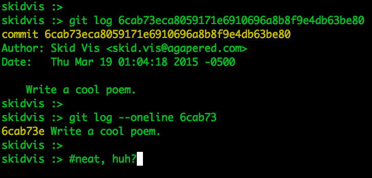
---
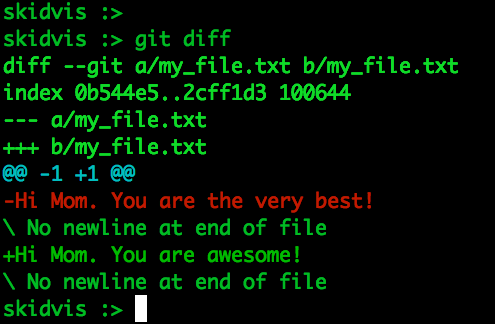
#[fit] ```git diff```
#[fit] 
#[fit] 
#[fit] 
##Show changes between commit and working tree, etc
#[fit]
---

#[fit] Branches
#[fit]
#[fit]
##Sometimes you need to LEAVE what you're working on.
#[fit]
#[fit]
# :leaves:
---
#[fit] ```git branch```
#[fit] 
#[fit] 
#[fit] 
###Shows all available branches.
#[fit]
#[fit]
#[fit]
#[fit]
# :evergreen_tree:
---
#[fit] ```git branch <branch>```
#[fit] 
#[fit] 
#[fit] 
###Create a new branch which mirrors the current working directory.
#[fit]
#[fit]
#[fit]
#[fit]
# :seedling:
---
#[fit] ```git checkout <branch>```
#[fit] 
#[fit] 
#[fit] 
###Switch to a branch.
#[fit]
#[fit]
#[fit]
#[fit]
# :herb:
---
#[fit] ```git checkout -b <branch>```
#[fit] 
#[fit] 
#[fit] 
###Create and switch to a new branch.
#[fit]
#[fit]
#[fit]
#[fit]
# :seedling: :herb:
---
#[fit] ```git branch -d <branch>```
#[fit] 
#[fit] 
#[fit] 
###Delete a branch.
#[fit]
#[fit]
#[fit]
#[fit]
# :scissors:
---
#[fit] ```git branch -D <branch>```
#[fit] 
#[fit] 
#[fit] 
###Force deleting of a branch.
#[fit]
#[fit]
#[fit]
#[fit]
# :bomb:
---
#[fit] ```git merge <branch>```
#[fit] 
#[fit] 
#[fit] 
###Pull the contents of the branch into the current working directory.
#[fit]
#[fit]
#[fit]
#[fit]
# :recycle:
---
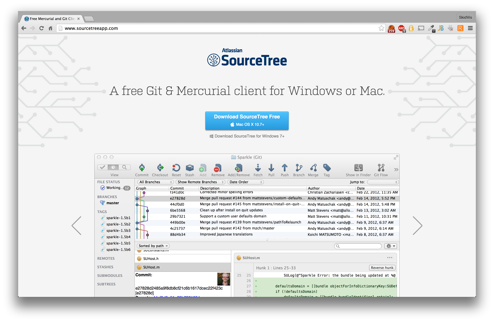
#[fit] sourcetreeapp.com
#[fit]
#[fit]
##It feels GUI.
---

#[fit] Halp!
#[fit]
##Sometimes you screw up.
#[fit]
# :ambulance:
---
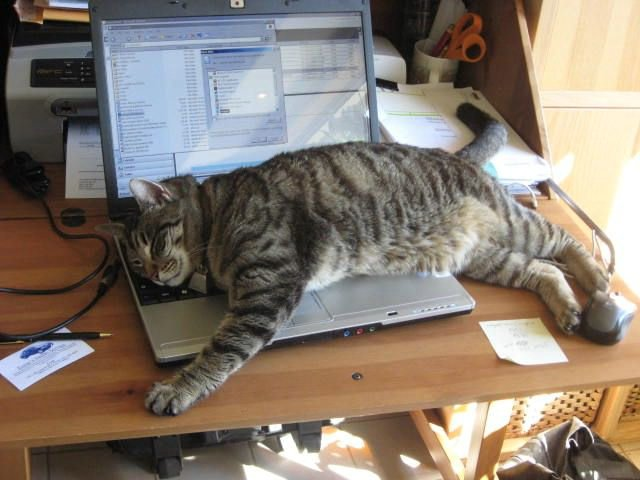
#[fit] The
#[fit]saidhsf /skdasfads
#[fit]scenario
# :cat2:
##Sometimes cats screw up.
---
#[fit] ```git reset --hard HEAD```
#[fit] 
#[fit] 
#[fit] 
###Undo all changes since the last commit.
#[fit]
---
#[fit] ```git reset --hard HEAD^```
#[fit] 
#[fit] 
#[fit] 
###Undo all changes and go back one commit.
#[fit]
---
#[fit] ```git reflog```
#[fit] 
#[fit] 
#[fit] 
###See a history of all changes to HEAD.
#[fit]
---
#[fit] ```git reset --hard <hash>```
#[fit] 
#[fit] 
#[fit] 
###Undo all changes and go back one commit.
#[fit]
---
#[fit] ```git checkout -b <branch> <hash>```
#[fit] 
#[fit] 
#[fit] 
###Checkout a previous commit into a new branch.
#[fit]
---

#[fit] The End.
#[fit]
#[fit]
##so sad. :sob:
---
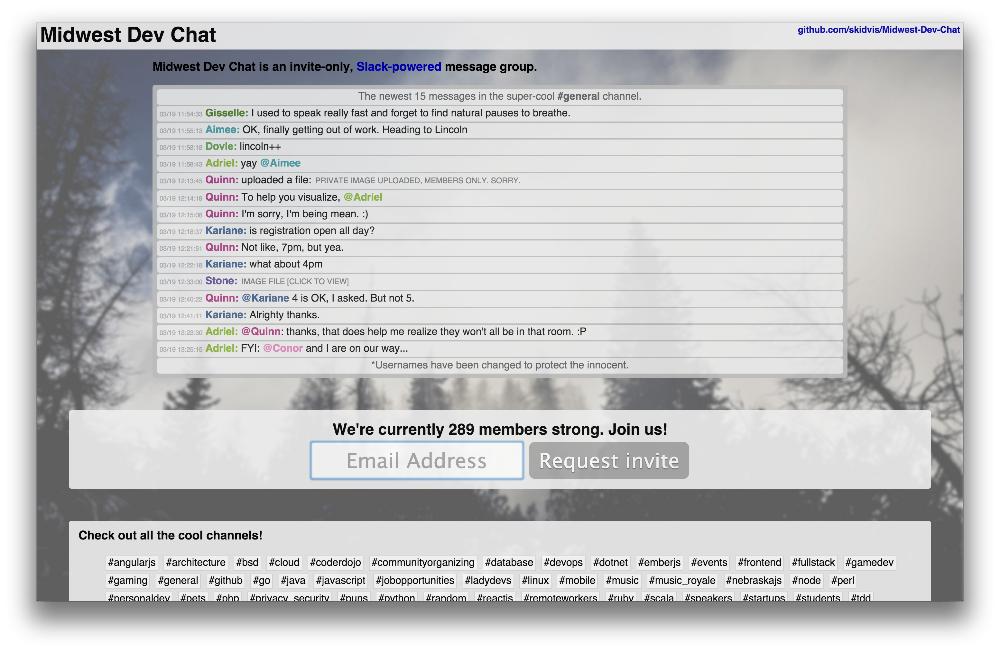
#[fit] MidwestDevChat.com
#[fit]
#[fit]
##Where we be.
---

#[fit] Questions?
#[fit]
# :confused:
#[fit]
## 
---

#[fit] Questions?
#[fit]
#@nicknisi :sunglasses:
#[fit]
##He's so smart.
---

#[fit] Love all the gifs??
#[fit]
#[fit]
#@zachleat
#[fit]
#[fit]
##He's my gif guru.
---

#[fit] 