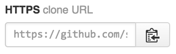

# Intro to Git - Skid Vis
This is my talk which introduces the basic Git commands. The slides are in pdf form here, but the real one had some animated gifs so it was a lot cooler. 

I recorded a screencast of the talk, and if you want to check it out here's the link:

https://www.youtube.com/watch?v=Jh98zncr87Q 

# Join Midwest Dev Chat

There's almost 300 devs from the midwest available to help you any time! It's like Stack Overflow, but live! 

Join us by visiting [MidwestDevChat.com](http://midwestdevchat.com)

Do that now.

# Forking and Pulling

If you're not familiar with doing a Fork and Pull on github, my talk doesn't cover that, but here's a step by step for you:

- Make sure you have a github account.
- Visit the Nebraska Code github page for the slides: [here](https://github.com/nebraskacode/2015-Slides-and-Demos)
- Click the icon that says Fork and select which account to fork it to:  
- This creates a copy of the repo into your account. Go to it.
- There's a clone url on the bottom right, copy that url.  

#### Now on your computer:

- Open up a command line on your computer and CD into the folder of your choice.
- Type ``git clone XXX`` where XXX is that url you just copied.
- That will copy everything to your computer.
- Create a new folder with your slides in it.
- Then add it add to staging: ``git add .``
- Commit your change: ``git commit -m "Add my slides for my_talk_name"``
- Send it all back to github: ``git push``

#### Now you need to tell Nebraska Code to add your change to their repo...
- Go back to the Nebraska Code repo.
- Click the green button for pull requests  
- Click on the link that says ``compare across forks``  
- Select your Fork from the list on the right. 
- Click the big green Create Pull Request button.  

#### Pretty sure you can take it from there. :)
..if not, join Midwest Dev Chat by going to midwestdevchat.com and myself or someone else will help you out. 

